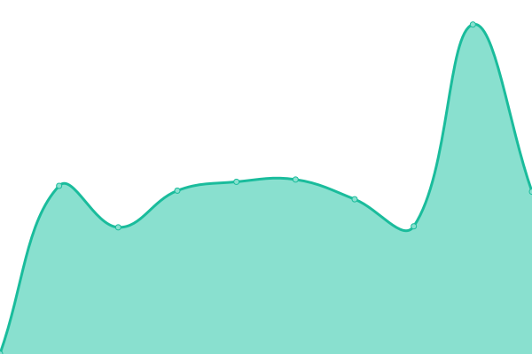

# [📈 Live Status](https://frankye23.github.io/staking-web): <!--live status--> **所有系统都可以正常运行**

This repository contains the open-source uptime monitor and status page for [frankye23](https://frankye23.github.io/staking-web), powered by [Upptime](https://github.com/upptime/upptime).

With [Upptime](https://upptime.js.org), you can get your own unlimited and free uptime monitor and status page, powered entirely by a GitHub repository. We use [Issues](https://github.com/frankye23/staking-web/issues) as incident reports, [Actions](https://github.com/frankye23/staking-web/actions) as uptime monitors, and [Pages](https://frankye23.github.io/staking-web) for the status page.

<!--start: status pages-->
<!-- This summary is generated by Upptime (https://github.com/upptime/upptime) -->
<!-- Do not edit this manually, your changes will be overwritten -->
<!-- prettier-ignore -->
| 链接 | 状态 | 历史 | 响应时间 | 正常运行时间 |
| --- | ------ | ------- | ------------- | ------ |
|  [Staking mainnet](https://stake.dxpool.com) | 🟩 正常运行 | [staking-mainnet.yml](https://github.com/frankye23/upptime-monitor/commits/HEAD/history/staking-mainnet.yml) | 

 265毫秒
     
 | 

<a href="https://frankye23.github.io/upptime-monitor/history/staking-mainnet">100.00%</a>
    

|  [Staking Dev](https://dev.stake.dxpool.in) | 🟩 正常运行 | [staking-dev.yml](https://github.com/frankye23/upptime-monitor/commits/HEAD/history/staking-dev.yml) | 

 611毫秒
     
 | 

<a href="https://frankye23.github.io/upptime-monitor/history/staking-dev">100.00%</a>
    

|  [DxPool](https://www.dxpool.com) | 🟩 正常运行 | [dx-pool.yml](https://github.com/frankye23/upptime-monitor/commits/HEAD/history/dx-pool.yml) | 

 674毫秒
     
 | 

<a href="https://frankye23.github.io/upptime-monitor/history/dx-pool">100.00%</a>
    

<!--end: status pages-->

[**Visit our status website →**](https://frankye23.github.io/staking-web)

## 📄 License

- Powered by: [Upptime](https://github.com/upptime/upptime)
- Code: [MIT](./LICENSE) © [frankye23](https://frankye23.github.io/staking-web)
- Data in the `./history` directory: [Open Database License](https://opendatacommons.org/licenses/odbl/1-0/)
